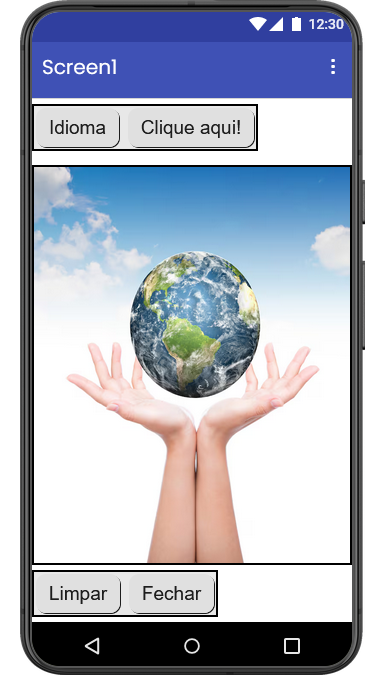
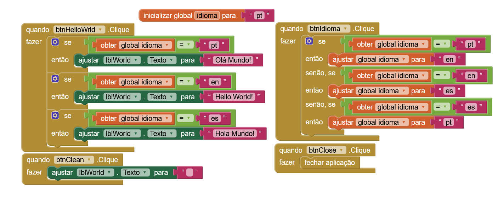
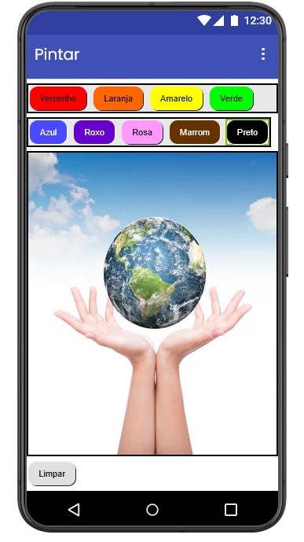
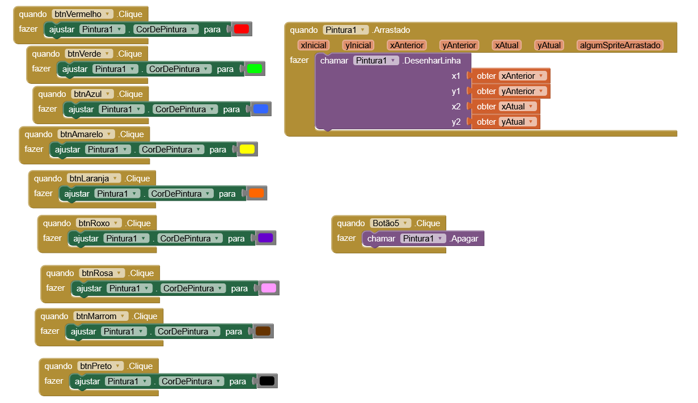
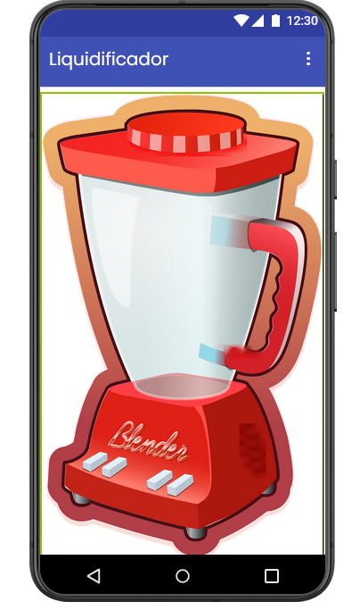
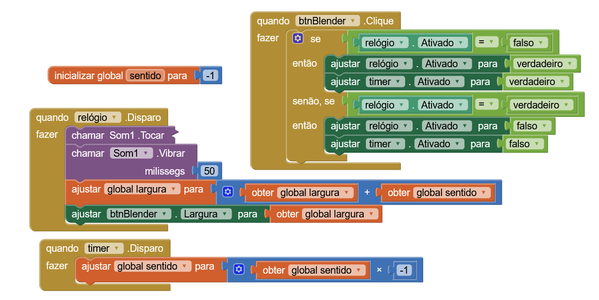

### ETEC Vasco Antônio Venchiarutti
### Desenvolvimento de Sistemas
### 2C1
### Autores:
Luigi Pozzani de Souza
Nicolas Camargo Costa Ceccato

---

# Projeto 1 – Primeiro Aplicativo (pg. 27)

### Descrição

Esse aplicativo tem o objetivo de mostrar a mensagem "Hello World" ao clicar em um botão.  
Ele funciona utilizando uma label inicialmente vazia, onde ao clicar no botão o texto é inserido, também existe um botão para limpar a label, e um para sair do aplicativo.

### O que foi melhorado em relação ao exemplo da apostila?

Foi adicionado a possibilidade de trocar o idioma do "Hello World" por meio de uma variável e de uma estrutura de decisão.

### Print da tela do Design:

### Print da tela dos Blocos:

---

# Projeto 2 – Segundo Aplicativo (pg. 46)

### Descrição

Esse aplicativo tem o objetivo de permitir o usuário desenhar em uma parte da tela, inclusive escolher entre cores.  
Ele funciona usando um bloco de "Pintura", que identifica onde o usuário arrastou o dedo e pinta nessa parte, tem botões para troca das cores.  

### O que foi melhorado em relação ao exemplo da apostila?

Eu adicionei 4 cores a mais (laranja, roxo, rosa, marrom e preto), organizei as cores com base no círculo cromático, e tive que incluir uma row a mais (organização horizontal).

### Print da tela do Design:

### Print da tela dos Blocos:

---

# Projeto 3 – Terceiro Aplicativo (pg. 56)

### Descrição

Esse aplicativo tem o objetivo de ao clicar na imagem do liquidificador (que na verdade é um botão), um som tocar e o dispositivo vibrar.  
Ele funciona usando um botão, um som (media) e a vibração, que funciona a partir do som.

### Print da tela do Design:

### Print da tela dos Blocos:

---
