### ETEC Vasco Antônio Venchiarutti
### Desenvolvimento de Sistemas
### 2C1
### Autores:
Luigi Pozzani de Souza
Nicolas Camargo Costa Ceccato

---
# 📱 Projeto
# Título: MédioOriente (Guerras Atuais do Oriente Médio)

## Descrição

Esse aplicativo tem como objetivo educar e informar sobre as presentes guerras no Oriente Médio, o foco não é em features complexas, mas sim em uma estrutura de texto um pouco mais complexa.
A maioria dele é composta de labels, botões e imagens, alguns botões redirecionam para locais externos (Google Maps e Iran Cost Ticker).

Abordaremos tela por tela, começando pela Screen 1 (Home):

## Screen 1

### Design:

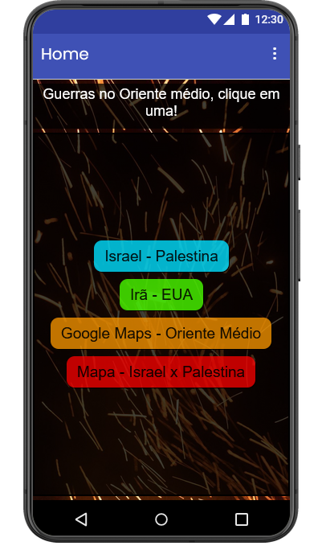

### Blocos:

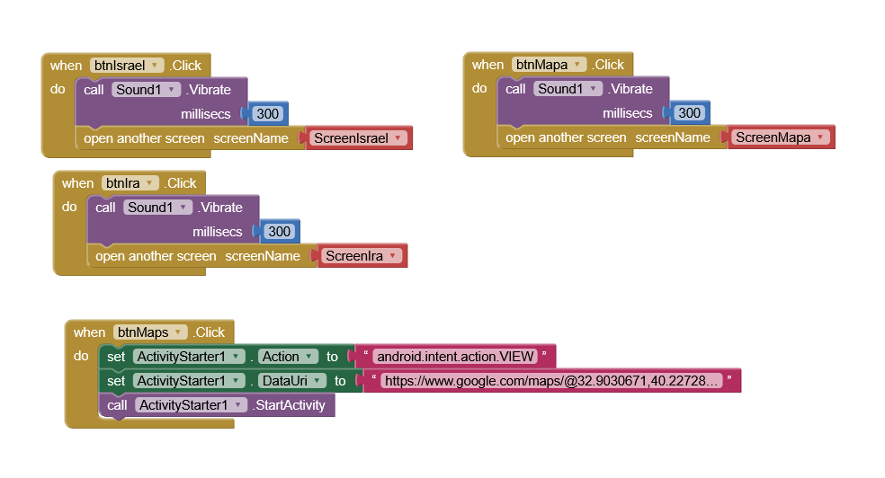

 
 
 

## ScreenIsrael

### Design: 

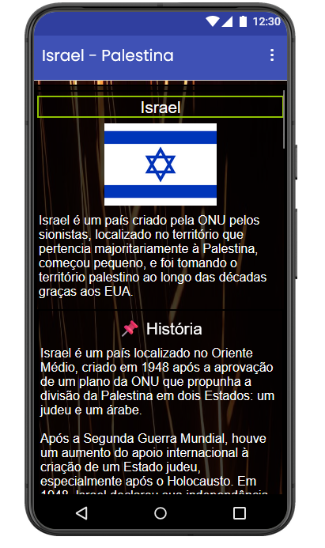

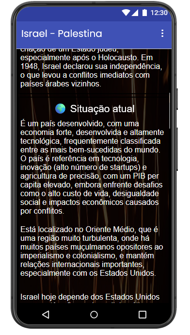

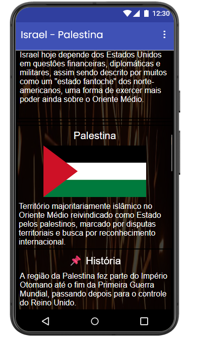

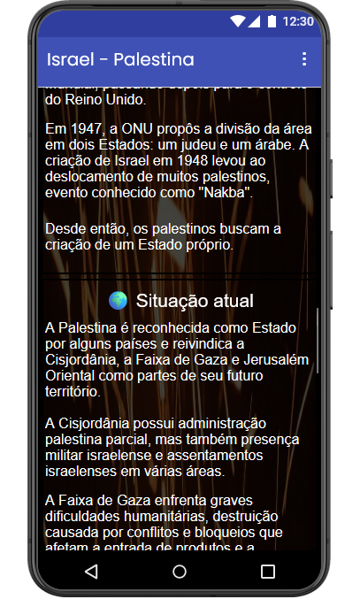

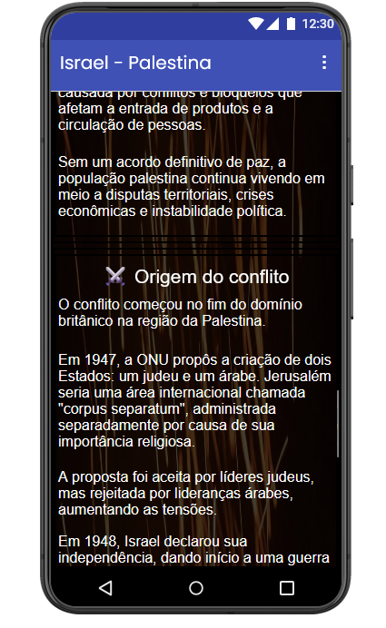

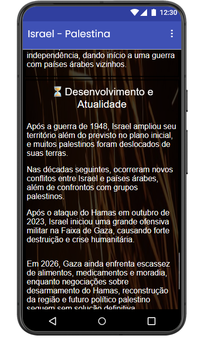

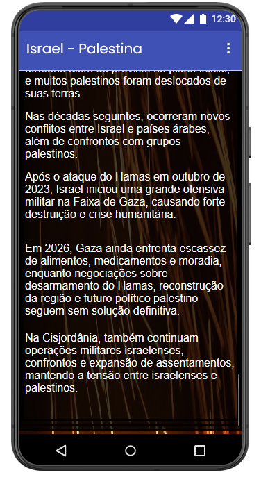

 
 
 

## ScreenIra

### Design:

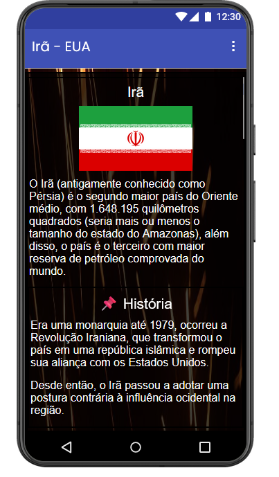

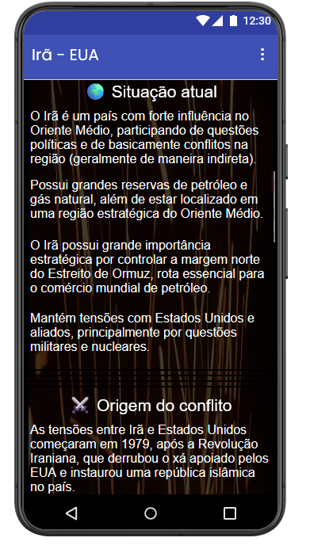

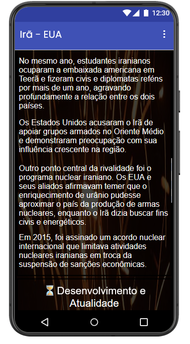

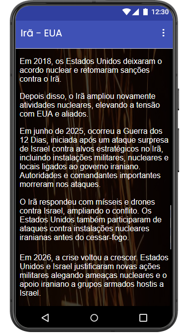

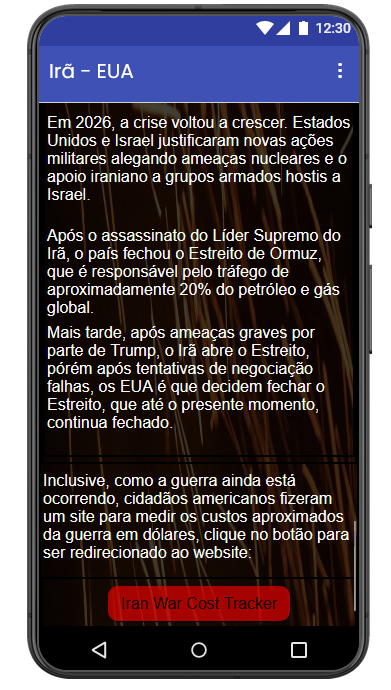

### Blocos:

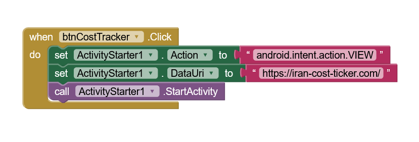

 
 
 

## ScreenMapa

### Design:

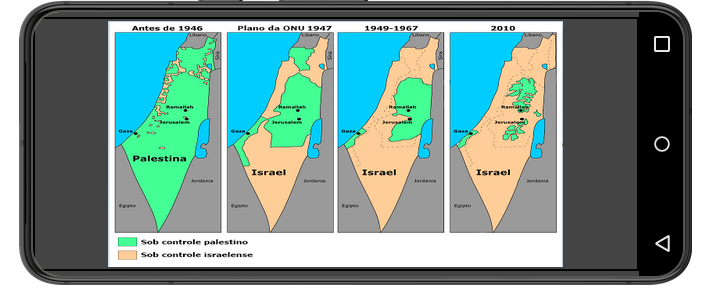
