# Programação de Aplicativos Mobile I

**Alunos:**  
Murilo Dias da Silva  
Nickolas Lins de Lemos  
Turma: 2C  

---

## 📱 PRIMEIRO APLICATIVO

Este aplicativo mostra uma imagem e, ao clicar no botão **"Clique Aqui!"**, uma legenda que estava oculta aparece na tela.  
Além disso, adicionamos um botão para **fechar a aplicação**.
### 📲 Interface do Aplicativo
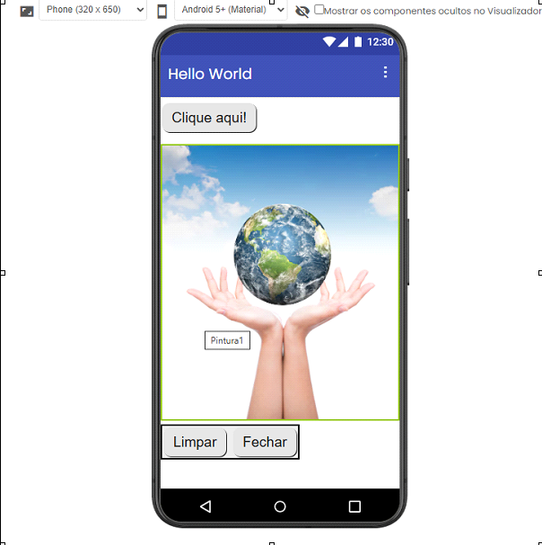
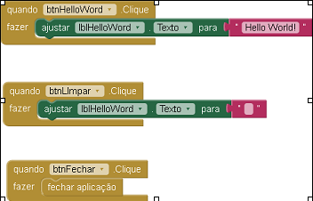

## 🎨 SEGUNDO APLICATIVO

O aplicativo permite que o usuário desenhe na tela usando diferentes cores.  

- O usuário escolhe uma cor  
- Desenha ao arrastar o dedo na tela  
- O botão **"Limpar"** apaga o desenho  
- Também foi feita a alteração do título do aplicativo  
### 📲 Interface do Aplicativo
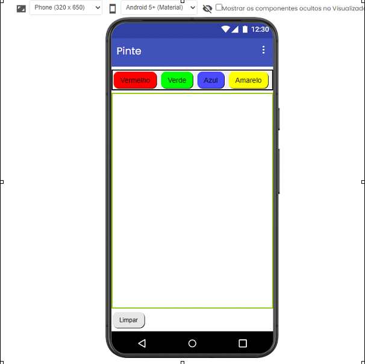
### 🧠 Lógica de Programação (Blocos)
[Blocos do Segundo App](imagens/4.png)

---

## 🔊 TERCEIRO APLICATIVO

Este aplicativo reproduz um som e ativa a vibração ao clicar na imagem de um **liquidificador** por alguns milissegundos.  

Também aumentamos a duração da vibração.
### 📲 Interface do Aplicativo
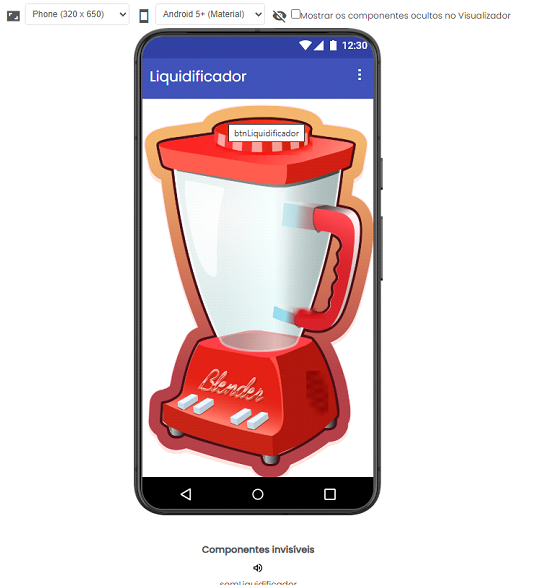
### 🧠 Lógica de Programação (Blocos)
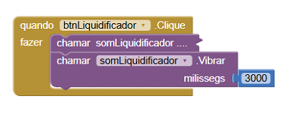

---

## 📸 QUARTO APLICATIVO

O aplicativo funciona como uma câmera:

- Ao clicar no botão **"Tirar foto"**, o usuário captura uma imagem  
- A imagem aparece ao lado na tela  
- Há também um botão para **fechar a aplicação**  
### 📲 Interface do Aplicativo
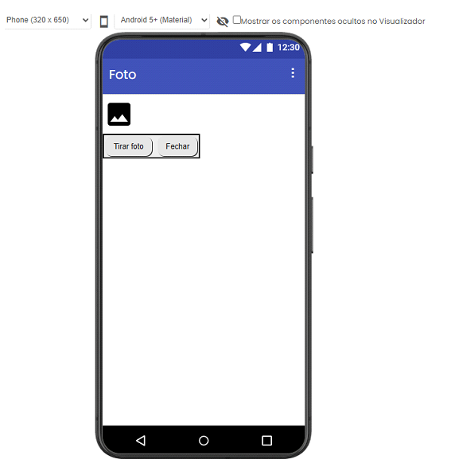
### 🧠 Lógica de Programação (Blocos)
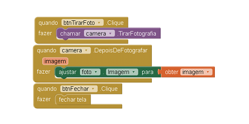

---

## 🔄 QUINTO APLICATIVO

Este aplicativo realiza navegação entre telas:

- Cada tela possui botões para navegação  
- É possível voltar para a tela inicial ou ir para outras telas  
- Os textos foram simplificados para melhor entendimento  
### 📲 Interface do Aplicativo
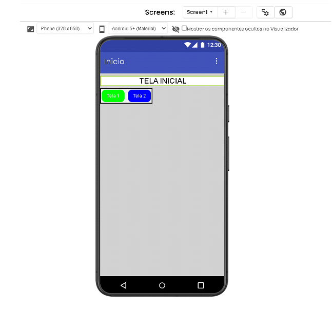
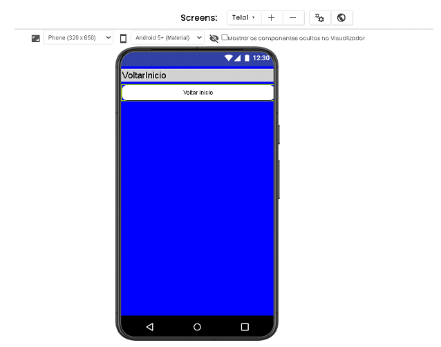
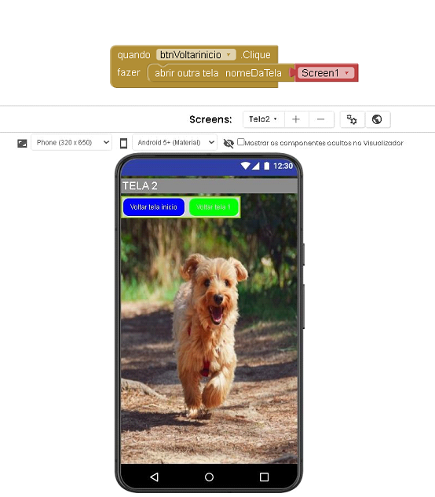
### 🧠 Lógica de Programação (Blocos)
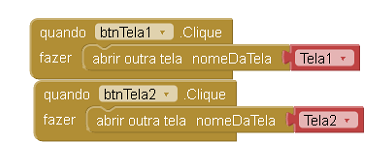
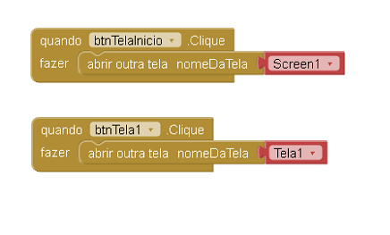

---

## 👤 SEXTO APLICATIVO

O aplicativo permite que o usuário digite seu nome:

- Há um campo de entrada de texto  
- Após inserir o nome, o app exibe uma saudação personalizada  
- Também foram alterados os nomes das variáveis no código  
### 📲 Interface do Aplicativo
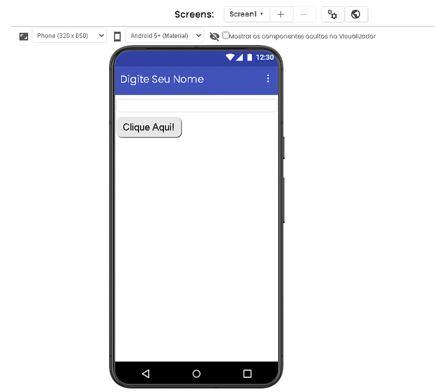
### 🧠 Lógica de Programação (Blocos)
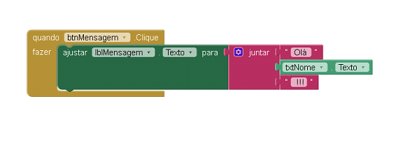
---